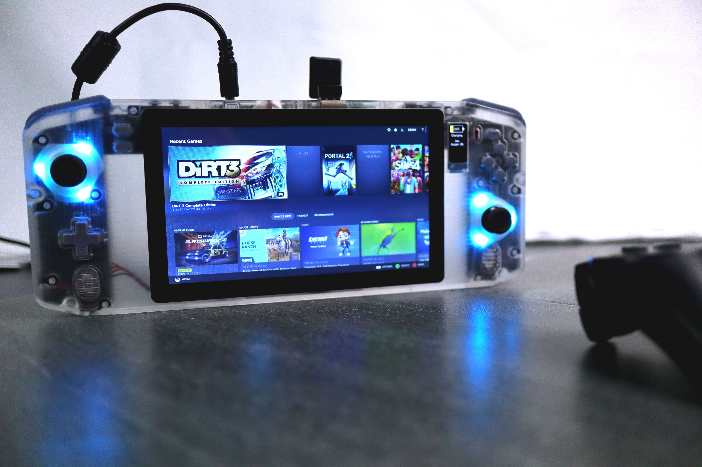

# NucDeck
The Open Source DIY Handheld Gaming PC!

 --- WARNING - PCB's and software incomplete. Begin at your own risk! ---

Refer to "NucDeck Assembly Instructions.PDF" for mechanical assembly details. Information for the electronics will be added once the controller PCB's are complete.

There are two different versions of the housing, Standard and NoRGB. The NoRGB version has had
the RGB joystick surrounds removed to simplify printing. If you choose the NoRGB version you can leave all of the 
associated components off the PCB's to save on cost.

There are two different versions of the buttons, membrane and clicky. The Membrane buttons are shorter and are
designed to be used with silicone membranes. I've included files for molds to make the membranes. If you have a resin printer
I encourage you to give this a try as it improves the feel of the buttons dramatically. FDM printers will struggle to produce the accuracy required to make these parts. The clicky version is slightly taller and can be used without the membranes.

#### Project Status
- [x] 3D Files
- [ ] Software: Controller Prototype Functional but not complete
- [ ] PCBs: Controller PCB's functional. Battery management still under development

Watch the series on Youtube as I design, build and test parts of this project:
- [Episode 1](https://youtu.be/xVYYCx3Qt4Y)
- [Episode 2](https://youtu.be/nOXd3axX4fw)
- [Episode 3](https://youtu.be/yHMnScoKIOE)
- [Episode 4](https://youtu.be/rP_sMztufNs)
- [Episode 5](https://youtu.be/sQocfy4pwIQ)
- [Bonus Episode - Battery Life Testing](https://youtu.be/6FQKwnMxRxI)
- [Episode 6](https://youtu.be/mfuAvgmuT2s)
- [Episode 7](https://youtu.be/nFNw7_WkteA)

I've found links for all of the parts on Aliexpress since its probably the cheapest option and will ship worldwide.

## Parts List

#### Display

Any 1024x600 50 Pin RGB Panel with overall dimensions no greater than 164.9x100x3.3mm.
This is the 700nit IPS panel I ended up using: https://www.aliexpress.com/item/1005005315348504.html

#### Display Driver

Pick the "PCB800812V1" option:
https://www.aliexpress.com/item/1005004252996145.html

#### USB Touch Controller

Pick option "USB Controller":
https://www.aliexpress.com/item/32976239800.html

#### Capacitive Touch Panel

This is the seller I used, but anyone selling for the same model tablet (Pritom K7) should do:
https://www.aliexpress.com/item/1005002490383977.html

#### Joysticks

Joysticks are an Alps RKJX21224001. Here's a cheap seller on aliexpress:
https://www.aliexpress.com/item/1005005264696228.html
Joystick caps are Xbox One compatible.

#### Batteries

4x 605080 3000mah Lithium cells. Here's a cheap supplier on Aliexpress:
https://www.aliexpress.com/item/32990176071.html

#### Info Screen

0.96" IPS 80x160 ST7735 TFT Display

You need the one these guys refer to as "Spliced Type".
https://www.aliexpress.com/item/1005001598020071.html

#### Threaded Inserts

Measurments are: Thread x OD x Length

17x M2x3.2x4

10x M3x5x5

2x M3x5x4

https://www.aliexpress.com/item/1005003582355741.html

#### Standoffs

10x M2x6mm Male to Female Standoffs
https://www.aliexpress.com/item/4001271908929.html

#### Trigger Springs

--NOTE-- Ignore the wire thickness in the Assembly Drawing, it is incorrect. I will fix it when I next need to make changes. Correct thickness listed here.
These guys have a lot of different options, they are pretty cheap so I'd grab a few different wire thicknesses
and test them out to see what you like. You need about 2mm ID on the coil section, so look for an ID of at least double the wire
thickness greater than 2mm. I found 0.4mm to feel a bit too thin, and 0.7mm is about the limit of the trigger supports so 0.5-0.6mm is probably the sweet spot.
https://www.aliexpress.com/item/1005004968066601.html

#### Trigger Magnets

You'll never need fridge magnets again!
https://www.aliexpress.com/item/1005003794726533.html

#### RGB Lights

You'll need both RGB LED's and WS2811 IC's if you're adding RGB to your controller PCB's.
These are the LED's I used. Any alternative in the same sized package should be fine too, just be cautious of
differing pin configurations.
https://www.aliexpress.com/item/1005003719602946.html

WS2811 IC's:
https://www.aliexpress.com/item/32844615804.html

#### Screws

Here's a list of the screws required for assembly. This list is also in the assembly instructions. SCHS is just a standard allen key head screw. CSK is a countersunk head screw. Most bolt suppliers should have these, otherwise ebay or aliexpress is your friend.

12x M3x6mm SHCS
2x M2x16 CSK
9x M2x5 CSK
14x M2x4 SHCS

## PCB's

Controller PCB's will be uploaded as part of the next batch of files once I have the designs tested and finalised.
